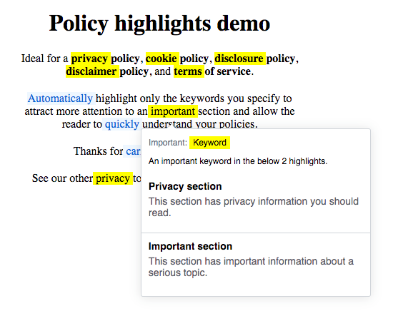

<p align="center">
  
</p>

<h1 align="center">Policy Highlights</h1>

<p align="center">Automatically highlight keywords on your privacy policy, cookie policy, disclosure policy, disclaimer policy, and terms of service so the user can quickly find and understand important sections.</p>

<p align="center">
  <a aria-label="npm package" href="https://www.npmjs.com/package/@weareprivacy/policy-highlights">
    
  </a>
  <a aria-label="contributors graph" href="https://github.com/weareprivacy/weareprivacy-policy-highlights/graphs/contributors">
    
  </a>
  <a aria-label="last commit" href="https://github.com/weareprivacy/weareprivacy-policy-highlights/commits/master">
    
  </a>
  <a aria-label="license" href="https://github.com/weareprivacy/weareprivacy-policy-highlights/blob/master/LICENSE.txt">
    
  </a>
</p>

## Usage

### General Usage

Include the script in your website privacy policy right before the `</body>` tag.

Policy highlights can be served from a CDN such as [JSDelivr](https://www.jsdelivr.com) or [Unpkg](https://unpkg.com). Simply use the `simple-icons` npm package and specify a version in the URL like the following:

```html
<script src="https://cdn.jsdelivr.net/npm/@weareprivacy/policy-highlights" type="text/javascript"></script>
<script src="https://unpkg.com/@weareprivacy/policy-highlights" type="text/javascript"></script>
```

## Example

See `dist/index.html`

## Development
See [DEVELOP.md](./DEVELOP.md) for development docs.

## License

[MIT](./LICENSE.txt) &copy; [GitHub](https://github.com/)